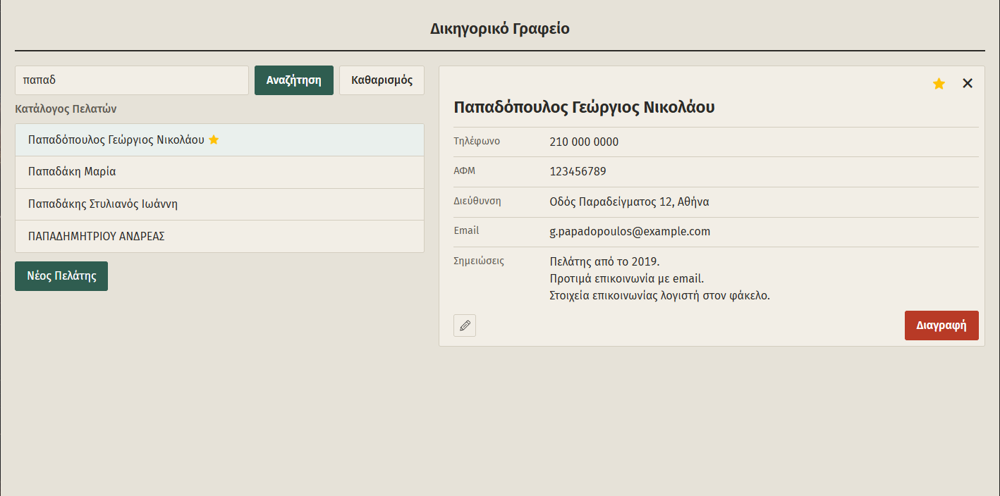
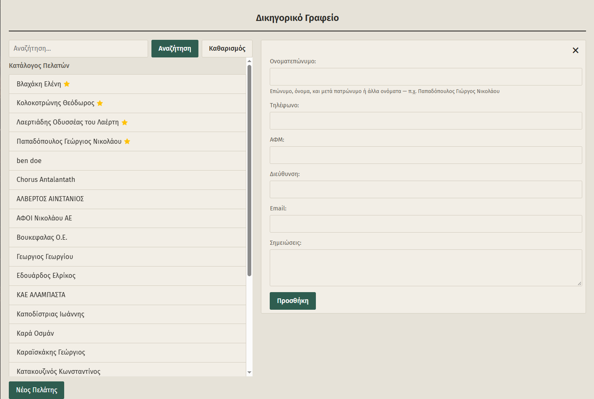

# LegalArchive

A client directory for small law firms, built for Greek-language data. It
runs on the office's own network, with no cloud service, and its interface
is in Greek.







**Status:** v1.0.0. The client directory is complete. A document archive
index is next.

## Features

- **Client list**, sorted alphabetically, with the firm's shared favorites
  pinned to the top
- **Search that works with Greek names**. `παπαδοπουλος`, `ΠΑΠΑΔΟΠΟΥΛΟΣ` and
  `Παπαδόπουλος` all find the same client.
- **A side panel for each client**, where you can view, edit, favorite or
  delete them without leaving the list
- **A URL for every client** (`/clients/42`), so bookmarks, the back button and
  several clients open in separate tabs all work
- **Keyboard-friendly forms.** Enter moves to the save button rather than
  submitting halfway through, so a client can be typed in without touching the
  mouse.
- **Works offline.** Fonts and assets are self-hosted, and nothing is sent to
  third parties.

## Why Greek names needed extra work

Greek names break simple text matching in three independent ways:

| Problem      | Example                                                    |
|--------------|------------------------------------------------------------|
| Case         | SQLite's `LIKE` and default sort only handle ASCII case    |
| Accents      | `Παπαδόπουλος` vs `Παπαδοπουλος`                           |
| Unicode form | `ό` can be one code point or `ο` plus a combining accent, which looks the same but is stored as different bytes |

Rather than making every comparison smarter, LegalArchive stores each name
twice: once as entered, for display, and once normalized, for searching and
sorting. Normalization is NFC → NFD, strip combining marks, casefold (which
also turns final `ς` into `σ`), then remove punctuation and collapse
whitespace. Search terms go through the same function, and the result is
searched with escaped SQL `LIKE` patterns, so `%` and `_` typed by a user
match only themselves. The normalized copy never leaves the API.

## Tech stack

| Layer    | Technology                                                     |
|----------|----------------------------------------------------------------|
| Frontend | React 19, TypeScript, Vite, React Router (data mode, loaders)  |
| Backend  | Python, FastAPI, Pydantic, Uvicorn                              |
| Database | SQLite                                                          |

The frontend is a single-page app. The backend is a small REST API:

| Method | Path            | Description                                       |
|--------|-----------------|---------------------------------------------------|
| GET    | `/clients`      | List clients, favorites first; optional `?name=` search |
| GET    | `/clients/{id}` | One client                                        |
| POST   | `/clients`      | Create a client                                   |
| PATCH  | `/clients/{id}` | Partial update; only the fields sent are changed  |
| DELETE | `/clients/{id}` | Delete a client permanently                       |

Interactive API docs are served at `/docs` while the backend is running.

## Getting started

Requirements: Python 3.10+, and Node.js 20.19+ or 22.12+.

```bash
# Backend: http://localhost:8000
cd server
python -m venv venv
source venv/bin/activate        # Windows: venv\Scripts\Activate.ps1
pip install -r requirements.txt
uvicorn main:app --reload
```

```bash
# Frontend: http://localhost:5173 (in a second terminal)
cd client
npm install
npm run dev
```

The SQLite database is created automatically on first run. It is gitignored,
because a real installation holds clients' personal data.

## Roadmap

- **Document archive index**: answer "where are this client's files?" by
  indexing the firm's existing folder structure, read-only
- **Cases** linked to each client, with status and outcome
- **Installation package** for running on a firm's own machine, including
  configurable addresses and backups
- Calendar and notes pages

Release history is in [CHANGELOG.md](CHANGELOG.md). Design decisions and
development notes are in [docs/DEVELOPMENT.md](docs/DEVELOPMENT.md).

## License

All rights reserved. The code is published for portfolio purposes; contact me if you'd like to use it.
